# 🎭 SidoCinemas - Use Cases & User Stories

## 👥 Actors & Roles

### Primary Actors
- **🎫 Customer**: Người dùng cuối, đặt vé xem phim
- **👔 Manager**: Quản lý rạp, điều hành hoạt động tại rạp cụ thể  
- **👑 Admin**: Quản trị viên hệ thống, toàn quyền quản lý

### Secondary Actors  
- **💳 Payment Gateway**: Hệ thống thanh toán bên ngoài
- **📧 Email Service**: Dịch vụ gửi email thông báo
- **📱 SMS Service**: Dịch vụ gửi SMS xác nhận

## 🎯 Use Case Diagram Overview

```mermaid
graph TB
    subgraph "SidoCinemas System"
        subgraph "Customer Use Cases"
            UC1[Register Account]
            UC2[Login/Logout] 
            UC3[Browse Movies]
            UC4[View Movie Details]
            UC5[Select Showtime]
            UC6[Choose Seats]
            UC7[Make Payment]
            UC8[View Booking History]
            UC9[Cancel Booking]
            UC10[Rate & Review Movie]
            UC11[Update Profile]
        end
        
        subgraph "Manager Use Cases"
            UC12[Manage Movies]
            UC13[Manage Showtimes]
            UC14[Manage Rooms]
            UC15[Manage Seats]
            UC16[Process Bookings]
            UC17[Manage Combos]
            UC18[View Reports]
            UC19[Validate Tickets]
        end
        
        subgraph "Admin Use Cases"
            UC20[Manage Users]
            UC21[Manage Cinemas]
            UC22[Assign Manager to Cinema]
            UC23[View System Reports]
            UC24[Manage Movie Categories]
            UC25[System Configuration]
            UC26[Monitor System Health]
        end
    end
    
    Customer --> UC1
    Customer --> UC2
    Customer --> UC3
    Customer --> UC4
    Customer --> UC5
    Customer --> UC6
    Customer --> UC7
    Customer --> UC8
    Customer --> UC9
    Customer --> UC10
    Customer --> UC11
    
    Manager --> UC12
    Manager --> UC13
    Manager --> UC14
    Manager --> UC15
    Manager --> UC16
    Manager --> UC17
    Manager --> UC18
    Manager --> UC19
    
    Admin --> UC20
    Admin --> UC21
    Admin --> UC22
    Admin --> UC23
    Admin --> UC24
    Admin --> UC25
    Admin --> UC26
```

## 🎫 Customer Use Cases

### UC1: Register Account
**Primary Actor**: Customer  
**Goal**: Tạo tài khoản mới để sử dụng hệ thống

**Main Success Scenario**:
1. Customer truy cập trang đăng ký
2. Customer nhập thông tin: email, mật khẩu, họ tên
3. Hệ thống validate thông tin (email duy nhất, mật khẩu mạnh)
4. Hệ thống tạo tài khoản với role CUSTOMER
5. Hệ thống gửi email xác nhận thành công

**Alternative Flows**:
- 3a. Email đã tồn tại → Hiển thị lỗi, yêu cầu email khác
- 3b. Mật khẩu không đáp ứng yêu cầu → Hiển thị hướng dẫn

**Business Rules**:
- Email phải duy nhất trong hệ thống
- Mật khẩu tối thiểu 8 ký tự, có chữ hoa, số và ký tự đặc biệt
- Account mới tự động có status ACTIVE

### UC2: Login/Logout
**Primary Actor**: Customer/Manager/Admin  
**Goal**: Đăng nhập/đăng xuất hệ thống

**Main Success Scenario** (Login):
1. User nhập email và mật khẩu
2. Hệ thống xác thực thông tin
3. Hệ thống tạo JWT access token + refresh token
4. Hệ thống chuyển hướng theo role:
   - Customer → Customer Dashboard
   - Manager → Manager Dashboard  
   - Admin → Admin Dashboard

**Alternative Flows**:
- 2a. Thông tin không chính xác → Hiển thị lỗi đăng nhập
- 2b. Account bị khóa → Thông báo tài khoản bị vô hiệu hóa

**Business Rules**:
- JWT token có thời hạn 1 giờ
- Refresh token có thời hạn 7 ngày
- Sau 5 lần đăng nhập sai liên tiếp → tạm khóa 15 phút

### UC3: Browse Movies
**Primary Actor**: Customer  
**Goal**: Xem danh sách phim đang chiếu và sắp chiếu

**Main Success Scenario**:
1. Customer truy cập trang chủ hoặc trang Movies
2. Hệ thống hiển thị danh sách phim với bộ lọc:
   - Thể loại (Action, Horror, Comedy, v.v.)
   - Trạng thái (Now Showing, Coming Soon)
   - Độ tuổi (P, T13, T16, T18)
3. Customer áp dụng filter nếu cần
4. Hệ thống cập nhật danh sách phim theo filter
5. Customer click vào phim để xem chi tiết

**Business Rules**:
- Phim STOPPED không hiển thị cho customer
- Hiển thị poster, title, genre, age rating, duration
- Sắp xếp mặc định theo popularity hoặc release date

### UC4: View Movie Details
**Primary Actor**: Customer  
**Goal**: Xem thông tin chi tiết phim và lịch chiếu

**Main Success Scenario**:
1. Customer click vào phim từ danh sách
2. Hệ thống hiển thị thông tin chi tiết:
   - Poster, trailer, synopsis
   - Thể loại, thời lượng, độ tuổi
   - Đánh giá và review từ users
   - Lịch chiếu theo ngày và rạp
3. Customer chọn ngày muốn xem
4. Hệ thống hiển thị các suất chiếu available
5. Customer click chọn suất chiếu → chuyển tới UC5

### UC5: Book Movie Tickets - Select Showtime
**Primary Actor**: Customer (đã đăng nhập)  
**Goal**: Chọn suất chiếu cho phim đã chọn

**Preconditions**: 
- Customer đã đăng nhập
- Đã chọn phim muốn xem

**Main Success Scenario**:
1. Hệ thống hiển thị lịch chiếu theo ngày
2. Hiển thị thông tin mỗi suất chiếu:
   - Thời gian bắt đầu/kết thúc
   - Rạp chiếu và phòng
   - Giá vé cơ bản
   - Số ghế còn trống
3. Customer chọn suất chiếu mong muốn
4. Hệ thống chuyển tới trang chọn ghế (UC6)

**Alternative Flows**:
- 3a. Suất chiếu đã hết vé → Hiển thị "Sold Out", không cho chọn
- 3b. Suất chiếu sắp bắt đầu (< 30 phút) → Cảnh báo nhưng vẫn cho đặt

### UC6: Choose Seats
**Primary Actor**: Customer  
**Goal**: Chọn ghế ngồi cho suất chiếu đã chọn

**Main Success Scenario**:
1. Hệ thống hiển thị sơ đồ phòng chiếu:
   - Layout ghế theo hàng (A-J) và số (1-12)
   - Trạng thái ghế: Available (xanh), Occupied (đỏ), Selected (vàng)
   - Giá ghế khác nhau: Standard, VIP, Couple
2. Customer click chọn ghế (có thể chọn nhiều ghế)
3. Hệ thống tính tổng tiền tạm tính
4. Hệ thống "hold" ghế trong 10 phút (lưu Redis)
5. Customer confirm chọn ghế → chuyển tới thanh toán (UC7)

**Alternative Flows**:
- 2a. Ghế đã được người khác hold → Không cho chọn, hiển thị thông báo
- 4a. Timeout 10 phút → Giải phóng ghế, yêu cầu chọn lại

**Business Rules**:
- Seat holding timeout: 10 phút
- Maximum 8 ghế/booking
- VIP seats có surcharge 50%
- Couple seats bán theo cặp (2 ghế)

### UC7: Make Payment
**Primary Actor**: Customer  
**Goal**: Thanh toán để hoàn tất đặt vé

**Main Success Scenario**:
1. Hệ thống hiển thị trang thanh toán với:
   - Tóm tắt booking (phim, suất chiếu, ghế)
   - Chi tiết giá (ticket + combo nếu có)
   - Tổng tiền cần thanh toán
2. Customer chọn phương thức thanh toán:
   - Thẻ tín dụng/ghi nợ
   - Ví điện tử
   - Chuyển khoản ngân hàng
3. Customer nhập thông tin thanh toán
4. Hệ thống xử lý với payment gateway
5. Payment thành công:
   - Tạo booking với status CONFIRMED
   - Tạo tickets với QR codes
   - Gửi email confirmation
   - Release seat holds

**Alternative Flows**:
- 4a. Payment failed → Giữ nguyên seat holds, cho phép thử lại
- 4b. Timeout thanh toán → Hủy booking, release seats

### UC8: View Booking History
**Primary Actor**: Customer  
**Goal**: Xem lịch sử các lần đặt vé

**Main Success Scenario**:
1. Customer truy cập trang "Booking History"
2. Hệ thống hiển thị danh sách bookings:
   - Thông tin phim, suất chiếu
   - Trạng thái booking (Confirmed, Cancelled)
   - Số ghế và tổng tiền
   - QR code (nếu confirmed)
3. Customer có thể:
   - View chi tiết booking
   - Download/print tickets
   - Cancel booking (nếu còn thời hạn)

### UC9: Cancel Booking
**Primary Actor**: Customer  
**Goal**: Hủy đặt vé đã confirm

**Preconditions**:
- Booking ở trạng thái CONFIRMED
- Thời gian suất chiếu > 2 giờ

**Main Success Scenario**:
1. Customer chọn "Cancel" trong booking history
2. Hệ thống hiển thị chính sách hủy và phí
3. Customer confirm hủy vé
4. Hệ thống:
   - Cập nhật booking status → CANCELLED
   - Release seats cho booking khác
   - Tạo refund request
   - Gửi email xác nhận hủy

**Business Rules**:
- Hủy vé > 2 giờ trước suất chiếu: hoàn 90%
- Hủy vé 30 phút - 2 giờ: hoàn 50%
- Hủy vé < 30 phút: không hoàn tiền

### UC10: Rate & Review Movie
**Primary Actor**: Customer  
**Goal**: Đánh giá và review phim đã xem

**Preconditions**: Customer đã có booking CONFIRMED cho phim đó

**Main Success Scenario**:
1. Customer truy cập trang chi tiết phim
2. Nếu đã có booking confirmed, hiện form review
3. Customer nhập:
   - Rating (1-5 stars)
   - Review text (optional)
4. Submit review
5. Hệ thống lưu review và cập nhật average rating

**Business Rules**:
- Chỉ review được phim đã đặt vé
- Mỗi customer chỉ review 1 lần/phim
- Review có thể edit trong 24h

## 👔 Manager Use Cases

### UC12: Manage Movies
**Primary Actor**: Manager  
**Goal**: Quản lý danh sách phim tại rạp

**Main Success Scenario**:
1. Manager truy cập "Movie Management"
2. Hệ thống hiển thị danh sách phim đang quản lý
3. Manager có thể:
   - **Create**: Thêm phim mới (title, genre, duration, poster)
   - **Read**: Xem chi tiết phim
   - **Update**: Sửa thông tin phim, đổi status
   - **Delete**: Xóa phim (nếu chưa có showtime)

**Business Rules**:
- Manager chỉ quản lý phim tại rạp được assigned
- Không thể xóa phim đã có booking
- Status transitions: Coming Soon → Now Showing → Stopped

### UC13: Manage Showtimes
**Primary Actor**: Manager  
**Goal**: Lập lịch chiếu phim tại các phòng

**Main Success Scenario**:
1. Manager chọn phim và phòng chiếu
2. Đặt thời gian bắt đầu
3. Hệ thống tự tính thời gian kết thúc (duration + 15min buffer)
4. Set giá vé cho suất chiếu
5. Confirm tạo showtime

**Business Rules**:
- Không được overlap showtime trong cùng phòng
- Buffer time 15 phút giữa các suất
- Không tạo showtime quá 1 tháng trước
- Giá vé có thể khác nhau theo time slot (prime time +20%)

### UC14: Manage Rooms & UC15: Manage Seats
**Primary Actor**: Manager  
**Goal**: Quản lý phòng chiếu và ghế ngồi

**Main Success Scenario**:
1. **Room Management**:
   - Create/Update phòng chiếu (tên, loại, sức chứa)
   - Set room type (Standard, VIP, IMAX)
2. **Seat Management**:
   - Design layout ghế (rows, seats per row)
   - Set seat types và pricing
   - Mark damaged seats unavailable

### UC16: Process Bookings
**Primary Actor**: Manager  
**Goal**: Xử lý và quản lý đặt vé tại rạp

**Main Success Scenario**:
1. Manager xem danh sách bookings theo:
   - Ngày chiếu
   - Trạng thái (Pending, Confirmed, Cancelled)
   - Phim/suất chiếu
2. Manager có thể:
   - Confirm booking thủ công (offline booking)
   - Cancel booking (với lý do)
   - Validate tickets tại cửa (QR scan)
   - Issue refunds

### UC17: Manage Combos
**Primary Actor**: Manager  
**Goal**: Quản lý combo đồ ăn/nước uống

**Main Success Scenario**:
1. Manager CRUD combo items:
   - Tên combo, mô tả, giá
   - Upload hình ảnh
   - Set availability status
2. Track combo sales trong bookings
3. Update giá và availability realtime

## 👑 Admin Use Cases

### UC20: Manage Users
**Primary Actor**: Admin  
**Goal**: Quản lý toàn bộ người dùng hệ thống

**Main Success Scenario**:
1. Admin xem danh sách users với filter/search
2. Admin có thể:
   - **View**: Chi tiết user profile và activity
   - **Update**: Chỉnh sửa thông tin user
   - **Delete**: Xóa user (với confirmation)
   - **Role Assignment**: Đổi role user (Customer ↔ Manager ↔ Admin)
   - **Status Management**: Active/Inactive/Ban user
   - **Cinema Assignment**: Gán manager cho rạp cụ thể

**Business Rules**:
- Chỉ có thể gán 1 manager/rạp
- Không thể tự xóa chính mình
- Manager bị unassign sẽ chuyển về role Customer

### UC21: Manage Cinemas
**Primary Actor**: Admin  
**Goal**: Quản lý chuỗi rạp chiếu

**Main Success Scenario**:
1. Admin CRUD cinemas:
   - **Create**: Thêm rạp mới (tên, địa chỉ)
   - **Update**: Sửa thông tin rạp
   - **Delete**: Xóa rạp (nếu không có room/booking)
2. View cinema performance metrics
3. Assign/reassign managers

### UC22: Assign Manager to Cinema
**Primary Actor**: Admin  
**Goal**: Phân công manager phụ trách rạp

**Main Success Scenario**:
1. Admin chọn user có role MANAGER
2. Chọn cinema chưa có manager
3. Assign manager → cinema
4. Manager chỉ có quyền quản lý rạp được assigned

**Business Rules**:
- 1 manager chỉ quản lý 1 rạp
- 1 rạp chỉ có 1 manager chính
- Manager có thể được reassign

### UC23: View System Reports
**Primary Actor**: Admin  
**Goal**: Xem báo cáo tổng quan hệ thống

**Main Success Scenario**:
1. Admin truy cập Dashboard với metrics:
   - **Revenue**: Tổng doanh thu, doanh thu theo rạp/phim
   - **Bookings**: Số lượng booking theo thời gian
   - **Users**: User growth, active users
   - **Performance**: Popular movies, peak times
2. Export reports (PDF/Excel)
3. Filter theo time range, cinema, movie

### UC24: Manage Movie Categories
**Primary Actor**: Admin  
**Goal**: Quản lý thể loại phim

**Main Success Scenario**:
1. Admin CRUD movie genres:
   - **Create**: Thêm thể loại mới (Action, Sci-Fi, v.v.)
   - **Update**: Sửa tên/mô tả thể loại
   - **Delete**: Xóa thể loại (nếu không có phim nào sử dụng)
2. View usage statistics của từng genre

### UC25: System Configuration
**Primary Actor**: Admin  
**Goal**: Cấu hình các tham số hệ thống

**Main Success Scenario**:
1. Admin cập nhật system settings:
   - **Booking**: Seat hold timeout, max seats per booking
   - **Payment**: Cancellation policies, refund rates
   - **Pricing**: Base prices, surcharge rates
   - **Email**: SMTP settings, templates
2. Changes áp dụng realtime

### UC26: Monitor System Health
**Primary Actor**: Admin  
**Goal**: Giám sát tình trạng hệ thống

**Main Success Scenario**:
1. Admin xem health status:
   - **Database**: Connection status, query performance
   - **Redis**: Cache hit rate, memory usage
   - **API**: Response times, error rates
   - **Storage**: Disk space, backup status
2. Set up alerts cho critical issues

## 🔄 Cross-Cutting Use Cases

### Error Handling
- **Network Errors**: Retry mechanism, fallback UI
- **Validation Errors**: Client + server side validation
- **Authorization Errors**: Redirect to login, role-based access
- **System Errors**: Graceful degradation, error logging

### Security Use Cases
- **Session Management**: JWT token refresh, secure logout
- **Input Validation**: SQL injection prevention, XSS protection
- **Rate Limiting**: Prevent spam booking, DDoS protection
- **Audit Logging**: Track sensitive operations

### Performance Use Cases
- **Caching**: Redis cache cho hot data
- **Pagination**: Efficient data loading
- **Image Optimization**: Lazy loading, CDN integration
- **Database Optimization**: Query optimization, indexing

---

Các use cases trên đại diện cho toàn bộ workflow của hệ thống SidoCinemas, từ customer journey đến administrative operations, đảm bảo hệ thống đáp ứng đầy đủ nhu cầu của tất cả stakeholders.